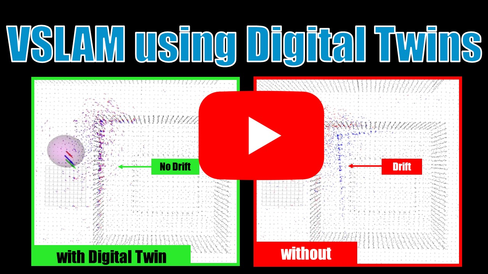

# Drift-free Visual SLAM using Digital Twins

This is a fork of the official implementation of **"Drift-free Visual SLAM using Digital Twin."** The original version was only tested on Ubuntu 20.04 and Ubuntu 18.04. The following instructions guide you through the installation on **Ubuntu 22.04**.


[](https://youtu.be/gmHnhWYfuW0)

This repo contains a sliding-window optimization-based odometry system fusing visual, inertial and global pose measurements obtained by registering to a Digital Twin. 
It builds on top of the visual-inertial odometry algorithm [SVO Pro](https://github.com/uzh-rpg/rpg_svo_pro_open).

## Publication
If you use this code in an academic context, please cite the following [RAL 2025 paper](https://rpg.ifi.uzh.ch/docs/RAL24_Merat.pdf).

R. Merat (equal contribution), G. Cioffi (equal contribution), L. Bauersfeld, and D. Scaramuzza,
"**Drift-free Visual SLAM using Digital Twins**,"
Robotics and Automation Letters (RA-L). 2025.

```
@article{merat2025drift,
  title={Drift-free Visual SLAM using Digital Twins},
  author={Merat, Roxane and Cioffi, Giovanni and Bauersfeld, Leonard and Scaramuzza, Davide},
  journal={IEEE Robotics and Automation Letters},
  year={2025},
  publisher={IEEE}
}
```

## Install on Ubuntu 22.04

## Installation on Ubuntu 22.04 with ROS Noetic

### Setting Up Docker

On the host machine, run the following commands to install and configure Docker:

```bash
sudo apt update
sudo apt install -y docker.io
sudo systemctl enable --now docker
sudo usermod -aG docker $USER  # Allow running Docker without sudo

```

Log out and log back in to apply the group changes.

### Running ROS Noetic in Docker

Pull and run the ROS Noetic container:

```bash
docker pull osrf/ros:noetic-desktop-full

docker run -it -d --name ros_noetic --net=host -v ~/ros_ws:/root/ros_ws osrf/ros:noetic-desktop-full bash
```

### Testing the Environment

After starting the container, you are now inside a ROS Noetic environment running on **Ubuntu 20.04** within Docker.

To test the setup, enter the container:

```bash
docker exec -it ros_noetic bash

```

Then, run the following commands:

```bash
roscore  # Start the ROS master

```

or check available ROS packages:

```bash
rospack list

```

If these commands execute successfully, your ROS Noetic environment is set up correctly.

[Next, Enable GUI in Your Existing Docker Container](rviz_on_docker.md)

### Install dependences

Install [catkin tools](https://catkin-tools.readthedocs.io/en/latest/installing.html) and [vcstools](https://github.com/dirk-thomas/vcstool) if you haven't done so before. Depending on your operating system, run
```sh
# For Ubuntu 20.04 + Noetic
sudo apt-get install python3-catkin-tools python3-vcstool python3-osrf-pycommon
```
Install system dependencies and dependencies for Ceres Solver
```sh
# system dep.
sudo apt-get install libglew-dev libopencv-dev libyaml-cpp-dev 
# Ceres dep.
sudo apt-get install libblas-dev liblapack-dev libsuitesparse-dev
```

### Clone and compile

Create a workspace and clone the code (`ROS-DISTRO`=`melodic`/`noetic`):
```sh
mkdir catkin_ws && cd catkin_ws
catkin config --init --mkdirs --extend /opt/ros/<ROS-DISTRO> --cmake-args -DCMAKE_BUILD_TYPE=Release
cd src
git clone git@github.com:uzh-rpg/rpg_svo_pro_with_digital_twins.git
vcs-import < ./rpg_svo_pro_with_digital_twins/dependencies.yaml
touch minkindr/minkindr_python/CATKIN_IGNORE
catkin build
```

### Trobleshooting

Refer to [SVO Pro](https://github.com/uzh-rpg/rpg_svo_pro_open#troubleshooting).

## Instructions
To launch the programm on our custom dataset download the rosbag and the city twin files from [here](https://download.ifi.uzh.ch/rpg/svo_with_digital_twins).
  
Place them correctly as specified in the configuration file, and run : 
```sh
roslaunch svo_ros Oerlikon.launch
```
Make sure you have all the config files as requested in the launch file, and play your rosbag in another terminal. 
When using your own data, adjust the topic names in the launchfile.

#### That's it already you are set! 

This will launch : 
- svo_ros with the global pose accepted as input to the optimizaqtion problem 
- svo_registration, which will register the local point cloud to the global city twin.
- rviz

## Credits

The VIO system used in this repo is based on [SVO Pro](https://github.com/uzh-rpg/rpg_svo_pro_open). Check [SVO Pro](https://github.com/uzh-rpg/rpg_svo_pro_open) for the full list of aknowledgments.

## License

The code is licensed under GPLv3. For commercial use, please contact the authors at cioffi@ifi.uzh.ch and sdavide@ifi.uzh.ch.

Check [SVO Pro](https://github.com/uzh-rpg/rpg_svo_pro_open) for licenses of the external dependencies.
