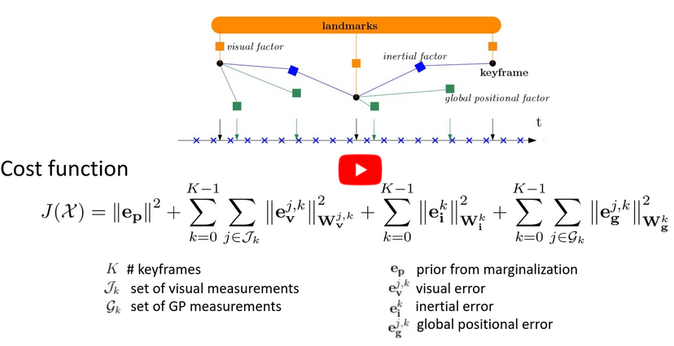

# Drift-free Visual SLAM using Digital Twins

<!-- [](https://youtu.be/jC_KiRLs6CY) -->

This repo contains a sliding-window optimization-based odometry system fusing visual, inertial and global pose measurements obtained by registering to a Digital Twin. 
It builds on top of the visual-inertial odometry algorithm [SVO Pro](https://github.com/uzh-rpg/rpg_svo_pro_open).

## Publication
If you use this code in an academic context, please cite the following [RAL 2024 paper](https://rpg.ifi.uzh.ch/docs/IROS20_Cioffi.pdf).

R. Merat (equal contribution), G. Cioffi (equal contribution), L. Bauersfeld, and D. Scaramuzza,
"**Drift-free Visual SLAM using Digital Twins**,"
Robotics and Automation Letters (RA-L). 2024.

```
@InProceedings{merat2020drift,
  author={Merat, Roxane and Cioffi, Giovanni Bauersfeld, Leonard and Scaramuzza, Davide},
  title={Drift-free Visual SLAM using Digital Twins},
  booktitle={Robotics and Automation Letters (RA-L)},
  organization={IEEE},
  year = {2024}
}
```

## Install

The code has been tested on

* Ubuntu 18.04 with ROS Melodic
* Ubuntu 20.04 with ROS Noetic

### Install dependences

Install [catkin tools](https://catkin-tools.readthedocs.io/en/latest/installing.html) and [vcstools](https://github.com/dirk-thomas/vcstool) if you haven't done so before. Depending on your operating system, run
```sh
# For Ubuntu 18.04 + Melodic
sudo apt-get install python-catkin-tools python-vcstool
```
or
```sh
# For Ubuntu 20.04 + Noetic
sudo apt-get install python3-catkin-tools python3-vcstool python3-osrf-pycommon
```
Install system dependencies and dependencies for Ceres Solver
```sh
# system dep.
sudo apt-get install libglew-dev libopencv-dev libyaml-cpp-dev 
# Ceres dep.
sudo apt-get install libblas-dev liblapack-dev libsuitesparse-dev
```

### Clone and compile

todo : Maybe here check the dependencie related to geographic-lib.

Create a workspace and clone the code (`ROS-DISTRO`=`melodic`/`noetic`):
```sh
mkdir svo_gps_ws && cd svo_gps_ws
catkin config --init --mkdirs --extend /opt/ros/<ROS-DISTRO> --cmake-args -DCMAKE_BUILD_TYPE=Release
cd src
git clone git@github.com:uzh-rpg/rpg_svo_pro_gps.git
vcs-import < ./rpg_svo_pro_gps/dependencies.yaml
touch minkindr/minkindr_python/CATKIN_IGNORE
catkin build
```

### Trobleshooting

Refer to [SVO Pro](https://github.com/uzh-rpg/rpg_svo_pro_open#troubleshooting).

## Instructions
To launch the programm on our custom dataset download the following files  :
- rosbag [link](link.here).
- city twin [link](link.here)
  
Place them correctly as specified in the configuration file, and run : 
```sh
roslaunch svo_ros Oerlikon.launch
```
Make sure you have all the config files as requested in the launch file, and play your rosbag in another terminal. 
When using your own data, adjust the topic names in the launchfile.

#### That's it already you are set! 

This will launch : 
- svo_ros with the global pose accepted as input to the optimizaqtion problem 
- svo_registration, which will register the local point cloud to the global city twin.
- rviz

## Credits

The VIO system used in this repo is based on [SVO Pro](https://github.com/uzh-rpg/rpg_svo_pro_open). Check [SVO Pro](https://github.com/uzh-rpg/rpg_svo_pro_open) for the full list of aknowledgments.

## License

The code is licensed under GPLv3. For commercial use, please contact the authors at cioffi@ifi.uzh.ch and sdavide@ifi.uzh.ch.

Check [SVO Pro](https://github.com/uzh-rpg/rpg_svo_pro_open) for licenses of the external dependencies.
